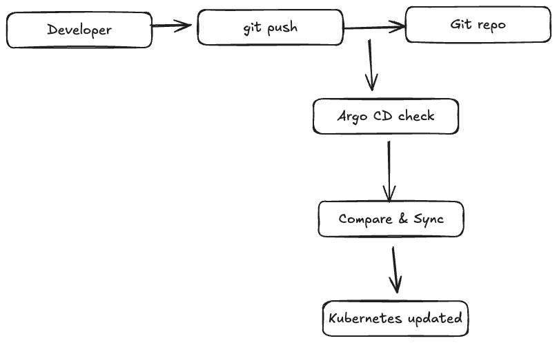
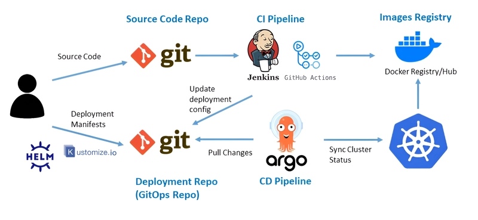

## Argo CD (GitOps Continuous Delivery)


- https://gitlab.com/keoKAY/sample-argocd-02/-/tree/master/templates?ref_type=heads
- How does Argo CD work?
- Argo CD architecture (API Server, Repo Server, Application Controller)
- Argo Webhooks
- Why webhooks are used
- Git → Argo CD sync flow


---

### 1. How does Argo CD work? (ដំណើរការ)

Argo CD ប្រើ GitOps principle

មានគំនិតសំខាន់ 2៖
- Git = Desired State (ស្ថានភាពដែលយើងចង់បាន)
- Kubernetes Cluster = Live State (ស្ថានភាពពិត)

Argo CD តែងតែធ្វើ 3 ជំហាន៖
- Pull config ពី Git
- Compare Git vs Cluster
- Sync → ឲ្យ Cluster ដូច Git

```bash
Developer → git push → Git repo
                     ↓
                Argo CD check
                     ↓
              Compare & Sync
                     ↓
            Kubernetes updated
```

ប្រសិនបើ cluster ខុសពី Git → Argo CD auto fix (self-healing)

---

### 2. Argo CD Architecture (រចនាសម្ព័ន្ធ)

Argo CD មាន 3 main components
#### 1. API Server

មុខងារ៖
- Web UI / CLI entry point
- Login / Auth / RBAC
- Receive Webhook ពី Git (GitHub, GitLab...)
- Expose REST / gRPC API

-> គឺជា Gateway របស់ Argo CD


#### 2. Repository Server

មុខងារ៖
- Clone Git repository
- Render Kubernetes manifests
- YAML
- Helm
- Kustomize
- Generate Desired State

-> គឺជា Git → YAML processor

#### 3. Application Controller (Brain)
មុខងារ៖
- Compare Desired State vs Live State
- Detect Drift (config ខុសពី Git)
- Sync resources ទៅ Kubernetes
- Self-healing & auto-sync

-> គឺជា Core engine របស់ Argo CD

---

### 3. Argo CD Webhooks

Yes, Argo CD has built-in support for webhooks to automatically trigger application synchronization when changes are pushed to your Git repository


Webhook = Event Notification ពី Git

Example
- Developer push code ទៅ GitHub
- GitHub → send webhook → Argo CD
- Argo CD → sync immediately

-> មិនចាំបាច់ polling (check every X minutes)

### 4. Why Webhooks are used? (ហេតុអ្វីប្រើ Webhook)

| Without Webhook    | With Webhook     |
| ------------------ | ---------------- |
| Poll every few min | Instant trigger  |
| Delay deploy       | Real-time deploy |
| More load          | Efficient        |

អត្ថប្រយោជន៍
- Deployment លឿន
- Near real-time sync
- Reduce CPU / API load
- Better CI/CD

### 5. Git → Argo CD Sync Flow (Flow ពេញ)
step-by-step
1. Developer push / commit -> Git
2. Git send Webhook → Argo CD API Server
3. API Server notify Repo Server
4. Repo Server pull latest config
5. Application Controller compare state
6. If different → Sync → Apply to cluster
7. Kubernetes updated

Cluster (Kubernetes) នឹង match Git 100%

### 6. Auto Sync + Self Healing

Argo CD អាច៖
- Auto deploy when Git changes
- Detect manual change in cluster
- Restore back to Git state

-> នេះហៅថា Drift Detection

### 7. Real Production Example

Git repo structure:
```bash
repo/
 ├── dev/
 ├── staging/
 └── prod/
```

- Merge → prod → auto deploy production
- Rollback = git revert
- Audit = git history

Safe + Traceable + Automated

### 8. Key Benefits of Argo CD
- Git = single source of truth
- Easy rollback
- Full audit history
- Declarative deployment
- Self-healing system
- Kubernetes-native


### 9. Easy Memory Trick

Remember 3 things:

- Repo Server → Read Git
- Application Controller → Compare & Sync
- API Server → UI + Webhook

