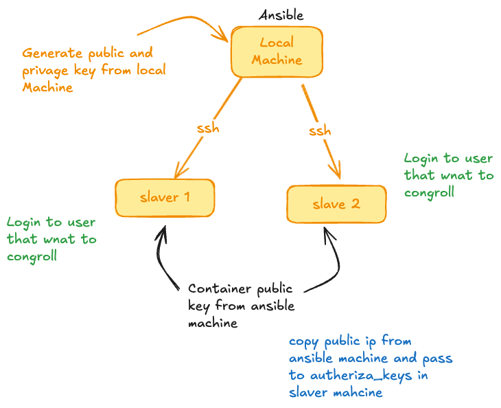
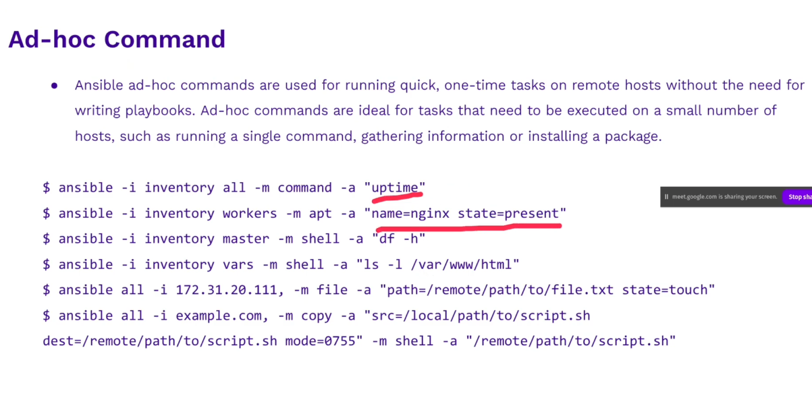
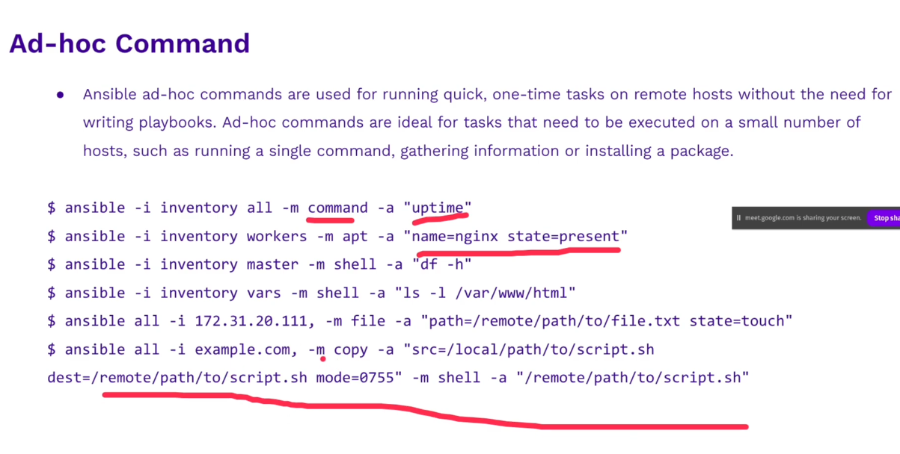

---

### Adhoc Command
Adhoc command syntax
```bash
# test ssh on local machine
ansible -i inventory.ini machine-name -m ping # one by one
ansible -i inventory.ini group-name -m ping # test one group

# test localhost machine
ansible -i inventory.ini localhost -m ping
```


### How to configure ssh for ansible
1. Go to controll node vm
> Generate ssh key on ansible `ssh-keygen` (Controll Node)
```bash tochratana@machine-nexus-ratana ~/.ssh> ssh-keygen ```
Copy `id_ed25519.pub` to the slave machine(Machine that we want to remote)



-m : module name ping

```bash
# ssh for the inventory
ansible -i inventory.ini localhost -m ping
ansible -i inventory.ini dev -m ping
ansible -i inventory.ini prod -m ping
ansible -i inventory.ini all -m ping
```


befor understand about playbook, we should know about ad-hoc
- first understand module `-m ping` so this is a module call ping


```bash
# run adhoc command module
ansible -i inventory.ini all -m command -a "uptime"
ansible -i inventory.ini all -m apt -a "name=nginx state=present" # if use ubsent = remove
ansible -i inventory.ini all -m apt -a "name=nginx state=present" --become # if use ubsent = remove, add become for sudo
```



Start write playbook
```yaml
- name: Install Common Service Playbook # name of playbook
  hosts: dev # what machine that we want to use this playbook to run, we can use name of group or name one by one of machine
  become: yes # it have true or yes, if we want to have like create user, sudo apt install ....
  tasks:
    - name: Update APT cache
      apt:
        update_cache: yes
    - name: Install Nginx
      apt:
        name: nginx
        state: present
    - name: Install Docker
      apt:
        name: docker
        state: present
    - name: Install Docker Compose
      apt:
        name: docker-compose
        state: present
    - name: Install fish shell
      apt:
        name: fist
        state: present
    - name: Install Neofetch
      apt:
        name: neofetch
        state: present
    - name: Add user into docker group
      user:
        name: tochratana
        groups: docker
        append: true 

# mean in the same inventory have folder name playbooks/fist.yaml
# ansible-playbook -i inventory.ini playbooks/fist.yaml

```


### NFS ( Network File System )
Distribute file storage: is a computer server that we use to shares file and directory over a network
(if we have 5 machines on the same network, data will be store in those five machine)
- NFS Server
- NFS Client
> NFS Storage class, Longhorn (By Rancher), Samba