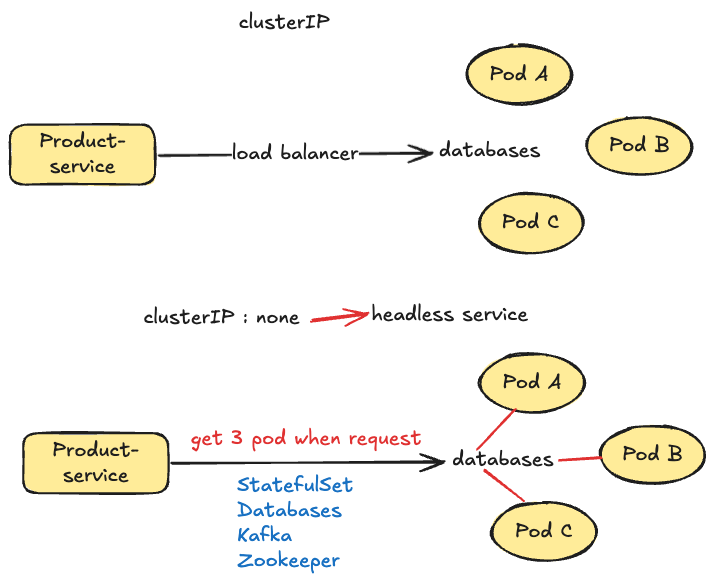

## What is Headless Service ?

This is NOT a new service type.

It is just a ClusterIP `service with no IP`.
```bash
clusterIP: None
```
example for using headless service
```yaml
apiVersion: v1
kind: Service
metadata:
  name: db
spec:
  clusterIP: None
```
Why?

Normally:
```bash
Service → Load balance → Pods
```
But Headless Service returns all pod IPs.

Example DNS result:
```bash
db.default.svc.cluster.local
```
returns:
```bash
10.244.1.5
10.244.1.6
10.244.1.7
```
This is used for:
- StatefulSet
- Databases
- Kafka
- Zookeeper

Example:
- mysql-0.db
- mysql-1.db
- mysql-2.db

