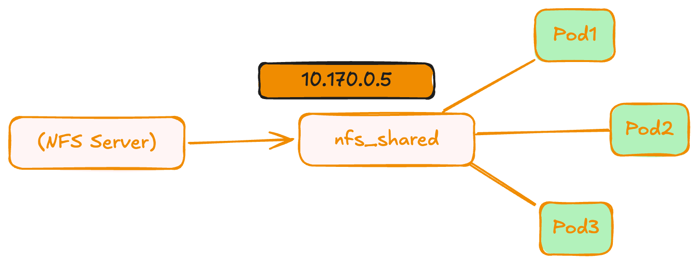

## NFS Note for learning class

និយាយងាយៗ៖
* Server មួយ
* មាន folder មួយ
* Machine ផ្សេងៗអាច mount folder នោះបាន



```yaml
volumes:
  - name: spring-vol
    nfs:
      server: 10.170.0.5
      path: /nfs_shared/spring-images
```