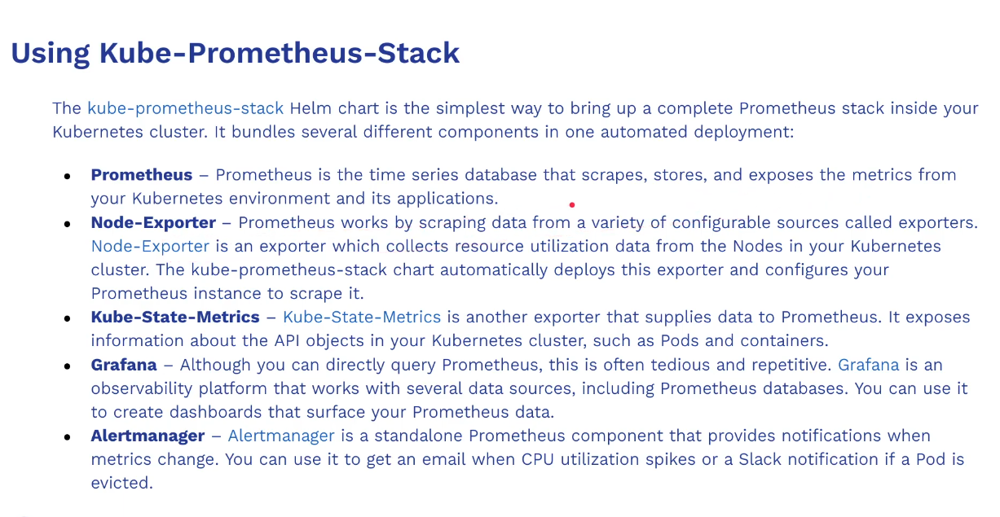

## Note for Prometheus tool

- https://github.com/prometheus-community/helm-charts/tree/main/charts/kube-prometheus-stack

- more document for configuration https://github.com/prometheus-operator/kube-prometheus

---
1. Add repo of the monitoring helm chart 
```bash 
helm repo add prometheus-community https://prometheus-community.github.io/helm-charts
helm repo update
# how do we install this in the specific namespace 
helm install monitor-stack-release prometheus-community/kube-prometheus-stack


# To esure that everything is running 
kubectl --namespace default \
    get pods \
    -l "release=monitor-stack-release"
```

### Configure the domain name for the prometheus and grafana 

```bash
# get password for login grafana if not work with prom-operator
kubectl get secret monitor-stack-release-grafana \
  -o jsonpath="{.data.admin-password}" | base64 --decode
```


### Configute notification channel for the alert to fired 
```bash
# 1. Run commmand i order to get the orignal value 
helm show values prometheus-community/kube-prometheus-stack # just print the file values, meam this file is a relaease from prometheus chart
helm show values prometheus-community/kube-prometheus-stack > values.yaml # cd to project or directory that we want to store file values.yaml
```
for config this we will find the file 
- search `Configuration for alertmanager`
- Find this configuration
```yaml
config:
    global:
      telegram_api_url: "https://api.telegram.org" # add this for configuration with telegram
      resolve_timeout: 5m
```
- search `group_by`
- find this configuration
```yaml
route:
      # alertname and job alert will be group together and send as one 
      group_by: ['altername', 'job'] # we must be group_by for organization
      group_wait: 30s
      group_interval: 5m
      repeat_interval: 12h
```

```bash
# 2. After we update the value file , we can upgrade helm chart 
helm upgrade \
    monitor-stack-release \
    prometheus-community/kube-prometheus-stack \
    -f values.yaml \
    -n default
```