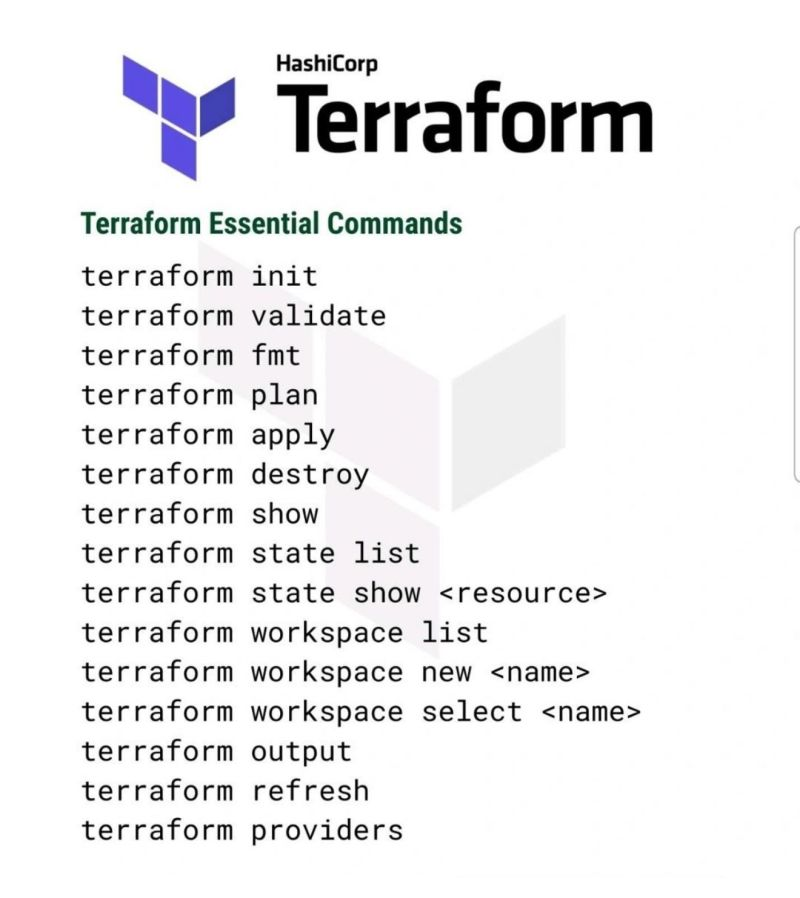
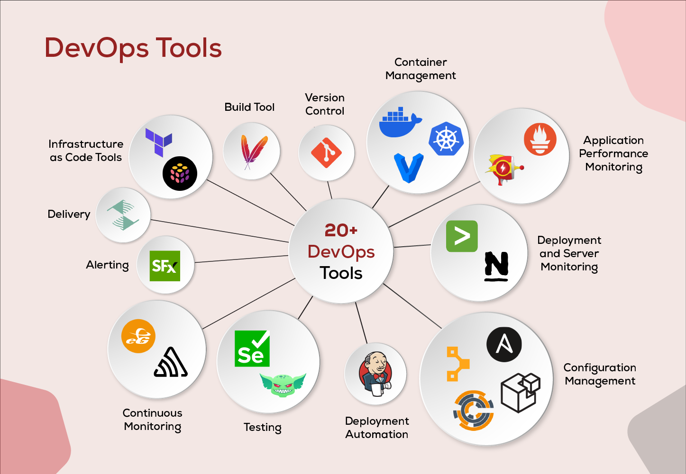

Continuous Monitoring
- Continuous Monitoring
- What is a Monitoring tool?
- Working with kube-prometheus-stack
- Accessing the monitoring dashboard for better insight
- Adding alerts for the telegram alerts
* [Monitoring vs Logging vs Observability](#monitoring-vs-logging-vs-observability)
* Tools ដែល DevOps ប្រើ (Prometheus, Grafana…)
* Monitoring ក្នុង Kubernetes
* Real example នៅ Production
* Top Tools ដែល DevOps Engineer ត្រូវចេះ
* Tool មួយណាសម្រាប់ Beginner ល្អ?
* Setup Prometheus + Grafana step-by-step
* Monitoring Architecture នៅ Production

---

- [https://www.inspirisys.com/blog-details/Top-20-DevOps-Tools-for-DevOps-Lifecycle/160](https://www.inspirisys.com/blog-details/Top-20-DevOps-Tools-for-DevOps-Lifecycle/160)

---

**Continuous Monitoring (ការត្រួតពិនិត្យជាប់ៗគ្នា)**

តើពាក្យថា monitoring នៅក្នុង DevOps មានន័យដូចម្តេច?

Monitoring នៅក្នុង DevOps មានន័យថា  ការតាមដាន និងពិនិត្យមើលស្ថានភាពប្រព័ន្ធ (System), Server, Application និង Infrastructure ជាបន្តបន្ទាប់ ដើម្បីដឹងថាវាដំណើរការល្អ ឬមានបញ្ហា។

វាជួយឲ្យ DevOps / Developer ដឹងភ្លាមៗថា៖
- Server ធ្វើការ OK ឬ Down
- CPU / RAM / Disk ប្រើប៉ុន្មាន
- Application មាន Error ឬយឺត
- User អាចប្រើ Service បានធម្មតា ឬអត់

*Continuous Monitoring* គឺជាការតាមដានប្រព័ន្ធ (System), Server, Application ឬ Infrastructure ជាបន្តបន្ទាប់ 24/7។

ដើម្បីរកឃើញកំហុសប្រព័ន្ធ លក្ខណៈពិសេស និងមុខងារនានាត្រូវបានត្រួតពិនិត្យជាបន្តបន្ទាប់។ ជាទូទៅ ការត្រួតពិនិត្យរួមបញ្ចូលសមត្ថភាពប្រតិបត្តិការ។ ដំណាក់កាលត្រួតពិនិត្យជាបន្តបន្ទាប់គាំទ្រដល់សុវត្ថិភាពនៃសេវាកម្ម។ ឧបករណ៍ពេញនិយមមួយចំនួនដែលប្រើក្នុងដំណាក់កាលនេះគឺ ELK Stack, Nagios និង Splunk។

ដើម្បីដឹងថា៖
- ប្រព័ន្ធដំណើរការល្អ ឬអត់
- មាន Error ឬ Problem ឬអត់
- CPU / RAM / Disk / Network ប្រើប៉ុន្មាន
- Service ណាធ្លាក់ (down) ឬយឺត

គោលបំណង៖ រកបញ្ហាឲ្យឃើញលឿន ហើយជួសជុលមុនពេល User មានបញ្ហា

---

**What is a Monitoring Tool? (Monitoring Tool គឺអ្វី?)**

Monitoring Tool គឺជា Software សម្រាប់៖
- Collect Metrics (CPU, Memory, Network, Pods, Nodes...)
- Visualize ជា Graph / Dashboard
- Alert ពេលមានបញ្ហា (Server down, CPU 100%, Pod crash...)

ឧទាហរណ៍ Tools ពេញនិយម
- Prometheus → ប្រមូល Metrics
- Grafana → បង្ហាញ Dashboard
- Alertmanager → ផ្ញើ Alert (Telegram, Email, Slack)

---

**Working with kube-prometheus-stack**

kube-prometheus-stack គឺជា Package មួយក្នុង Kubernetes ដែលមានរួចជាស្រេច៖
- Prometheus
- Grafana
- Alertmanager
- Node Exporter
- Kubernetes Monitoring

វាជួយឲ្យយើង Install Monitoring លើ Kubernetes ងាយៗ ដោយប្រើ Helm តែម្តង

អ្វីដែលវាធ្វើ
- Monitor Nodes, Pods, Containers
- Collect Metrics ពី Kubernetes
- Create Dashboard អូតូម៉ាទិច
- Support Alert

---

**Accessing the Monitoring Dashboard (ចូលមើល Dashboard)**

បន្ទាប់ពី install kube-prometheus-stack អ្នកអាចចូលមើល Grafana Dashboard ដើម្បីឃើញ៖

- CPU / Memory Usage
- Pod Health
- Node Status
- Network Traffic
- Error Rate

Dashboard ជួយឲ្យយើងយល់ស្ថានភាព System ពិតៗ (Real-time insight)

---

**Adding Alerts for Telegram (ផ្ញើ Alert ទៅ Telegram)**

យើងអាចកំណត់ Alert ដើម្បីឲ្យប្រព័ន្ធផ្ញើសារ Telegram ពេលមានបញ្ហា ដូចជា៖

- Pod Crash
- CPU > 80%
- Node Down
- Service Not Responding

ដំណើរការសង្ខេប
- Create Telegram Bot (BotFather)
- ទទួលបាន BOT_TOKEN
- ទទួលបាន CHAT_ID
- Configure នៅក្នុង Alertmanager
- កំណត់ Alert Rules (CPU, Memory, Pod...)

ពេលមានបញ្ហា → Telegram នឹងផ្ញើសារ Auto

---

Tools ដែលត្រូវបានគេប្រើប្រាស់ដើម្បីធ្វើ Monitoring
- Infrastructure & System Monitoring
  - Prometheus → ប្រមូល Metrics (CPU, RAM, Network, Kubernetes)
  - Grafana → បង្ហាញ Graph / Dashboard ស្អាតៗ
  - Zabbix → Monitor Server, Network, Service
  - Nagios → Monitoring បែប Classic (Server, Service)
- Kubernetes & Container Monitoring
  - kube-prometheus-stack → Package មាន Prometheus + Grafana + Alertmanager
  - Prometheus Operator → Manage Prometheus ក្នុង Kubernetes ងាយៗ
  - cAdvisor → មើល Resource Containers (Docker / K8s)
- Logging (មើល Logs & Error)
  - ELK Stack
  - Elasticsearch → Store Logs
  - Logstash → Process Logs
  - Kibana → Visualize Logs
- Loki → Logging Tool របស់ Grafana (Lightweight)
- Cloud Monitoring
  - Amazon CloudWatch → Monitoring AWS Resources\
  - Google Cloud Monitoring → Monitoring នៅ GCP
  - Azure Monitor → Monitoring នៅ Azure
- APM (Application Performance Monitoring)
  - Datadog → Monitor App + Infra + Logs + Alert
  - New Relic → មើល Performance App, Response Time
  - AppDynamics → Monitor Business + Application
- Alerting Tools (ផ្ញើ Alert)
  - Alertmanager (មកជាមួយ Prometheus) → Telegram, Slack, Email
  - Grafana Alert → Alert ពី Dashboard
  - PagerDuty → Incident Management

#### Monitoring vs Logging vs Observability
