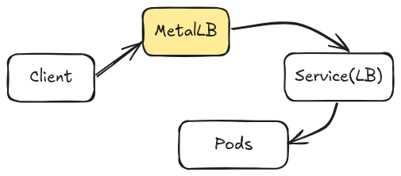
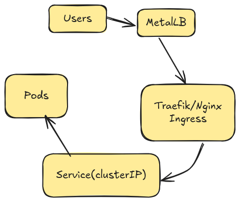

## Using the service type of loadbalacner 

when we are not working with cloud kubernetes 
you can use it own by 

## Using MetaLB


Example confnig of Metal LB 
```yaml 
apiVersion: metallb.io/v1beta1
kind: IPAddressPool 
metadata: 
    name: local-pool 
spec: 
    addresses: 
    - 192.169.1.240-192.168.1.250
```

## Using ingress controller 


Why is this perferered ?
- One entry point
- TLS termination 
- Path & Domain routing 
- Lower IP usage 

### Best Architecture for On-Prem ( What props use )
